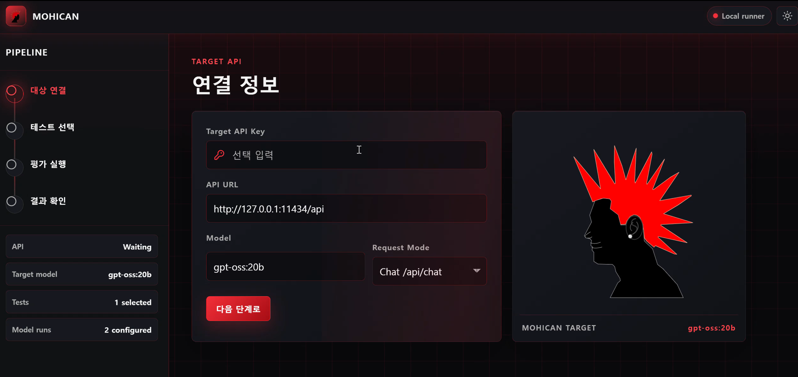

<div align="center">


# Mohican

**An LLM security evaluation platform that unifies multiple red-team scanners behind a single dashboard.**

[](https://react.dev/)
[](https://www.typescriptlang.org/)
[](https://vitejs.dev/)
[](https://www.python.org/)
[](https://fastapi.tiangolo.com/)
[](https://docs.pydantic.dev/)
[](https://www.uvicorn.org/)
[](https://www.promptfoo.dev/)
[](https://github.com/leondz/garak)
[](#license)

</div>

## Demo

<p align="center">
  <a href="https://youtu.be/yBIpFi84qnA">
    
  </a>
  <br>
  <em>Click the thumbnail to watch the demo on YouTube.</em>
</p>

## Screenshot

<p align="center">
  
</p>

## Table of Contents

- [Overview](#overview)
- [Why Mohican](#why-mohican)
- [Features](#features)
- [Architecture](#architecture)
- [Repository Structure](#repository-structure)
- [Getting Started](#getting-started)
- [Testing](#testing)
- [Result Format](#result-format)
- [Current Scope](#current-scope)
- [Roadmap](#roadmap)

## Overview

Mohican is a dashboard-style service that lets users orchestrate multiple open-source LLM red-team scanners — such as [`promptfoo`](https://www.promptfoo.dev/) and [`garak`](https://github.com/leondz/garak) — from a single web UI. Instead of running each tool separately with its own CLI, configuration, and result format, Mohican turns the workflow of *register target → pick vulnerability classes → run modules → review results* into one coherent, repeatable flow.

The goal is not to ship yet another scanner, but to be an **AI security evaluation orchestration platform**: pluggable evaluation modules, a common result schema, and a UI that focuses on *what to test*, not *which CLI to remember*.

## Why Mohican

LLM red-team tooling is fragmented. Different scanners excel at different things — some at prompt injection detection, some at jailbreak / policy-bypass testing, others at custom scenario evaluation. In practice, that means:

- Each tool has its own CLI flags, config files, and output formats.
- Comparing results across tools is manual and error-prone.
- Onboarding non-specialists (developers, ops teams) is hard.

Mohican abstracts the tool selection. Users pick the **vulnerability classes** they care about (Prompt Injection, Indirect Injection, Jailbreak, Tool Abuse, …), and Mohican wires up the appropriate evaluation modules and normalizes their output.

## Features

- Register evaluation targets (API endpoint + model metadata)
- Pick vulnerability classes: Prompt Injection, Indirect Injection, Jailbreak, Tool Abuse
- Block-based test composition flow
- Run evaluations powered by `promptfoo` and `garak`
- Background job scheduler with status tracking
- Live execution logs and event stream
- Normalized output: `summary` / `findings` / `artifacts` / `engineResults`
- Markdown report generation and download
- Attack module ranking UI

## Architecture

```text
React Frontend
  └─ FastAPI Backend
       └─ Job Scheduler
            └─ promptfoo / garak (subprocess)
                 └─ Target Model API
                      └─ Normalized Result
                           └─ Dashboard / Markdown Report
```

Mohican does **not** import `promptfoo` or `garak` into a long-running process. Each job runs the upstream CLI as a subprocess inside its own working directory, with config and output files materialized on disk. This avoids cross-tool global-state collisions and keeps every run reproducible as a self-contained artifact bundle.

## Repository Structure

```text
.
├── index.html                          # Frontend entry HTML
├── package.json                        # Frontend deps & scripts
├── tsconfig.json
├── vite.config.ts                      # Vite build config
│
├── public/                             # Frontend static assets
│   └── mohican.png                     # App logo
│
├── src/                                # React + Vite frontend (TypeScript)
│   ├── App.tsx
│   ├── main.tsx
│   ├── styles.css
│   └── vite-env.d.ts
│
├── backend/                            # FastAPI job runner
│   ├── pyproject.toml
│   ├── src/mohican_backend/
│   │   ├── main.py                     # FastAPI app entry
│   │   ├── models.py                   # Pydantic schemas
│   │   ├── settings.py                 # Runtime config & env vars
│   │   ├── store.py                    # Job persistence
│   │   ├── scheduler.py                # Background job scheduler
│   │   ├── process_runner.py           # Subprocess wrapper
│   │   ├── catalog.py                  # Engine / module catalog
│   │   ├── artifacts.py                # Run artifact handling
│   │   └── engines/                    # Engine adapters
│   │       ├── base.py
│   │       ├── promptfoo.py
│   │       ├── garak.py
│   │       └── utils.py
│   └── tests/                          # Backend unit tests
│
├── report-generator/                   # Markdown report generator
│   ├── generate_report.py
│   ├── report_template.md.j2
│   ├── requirements.txt
│   └── sample_results.json
│
└── docs/
    ├── assets/                         # README & docs media (logo, screenshot, demo.mp4)
    ├── backend-api.md                  # Frontend ↔ backend API notes
    ├── backend-design/                 # Runner architecture & schemas
    └── dashboard-blocks/               # UI block / scenario design
```

External tool sources (`promptfoo`, `garak`) and run artifacts (`.mohican/`, `.promptfoo/`) are intentionally **not** vendored — they are resolved from the system-installed CLIs or via environment variables.

## Getting Started

### Prerequisites

- Node.js 18+
- Python 3.10+
- `promptfoo` and `garak` installed and on `PATH` (or pointed to via env vars below)

### 1. Run the backend

```bash
cd backend
python -m venv .venv
. .venv/bin/activate
pip install -e .
PYTHONPATH=src uvicorn mohican_backend.main:app --host 127.0.0.1 --port 8088
```

If the external tools live outside the repo, point Mohican at them:

```bash
export MOHICAN_PROMPTFOO_REPO=/path/to/promptfoo
export MOHICAN_GARAK_REPO=/path/to/garak
export MOHICAN_STORAGE_DIR=/path/to/.mohican/jobs
```

### 2. Run the frontend

```bash
npm install --no-bin-links
npm run dev
```

The default backend URL is `http://127.0.0.1:8088`. To target a different backend:

```bash
VITE_MOHICAN_API_BASE_URL=http://127.0.0.1:8088 npm run dev
```

## Testing

Frontend build:

```bash
npm run build
```

Backend unit tests:

```bash
cd backend
PYTHONPATH=src python -m unittest discover -s tests -v
```

Report generator smoke test:

```bash
cd report-generator
python generate_report.py --input sample_results.json --output /tmp/mohican_sample_report.md
```

## Result Format

Mohican does not surface raw per-tool output. Every engine's results are normalized to a common shape:

```text
summary
findings
artifacts
engineResults
```

The frontend renders the overview, per-engine results, finding list, artifact list, and Markdown report directly off this normalized payload.

## Current Scope

- `promptfoo` and `garak` execution supported
- Demo-grade minimum attack unit per run
- Per-block status surfaced in the frontend
- Execution batched at the engine level on the backend
- Attack module ranking is currently a UI mockup with placeholder scores

## Roadmap

- Per-block real execution result separation
- Real risk scoring per attack module
- Pluggable custom evaluation modules
- Org-level policy-driven evaluation templates
- Extended report formats

## License

MIT
